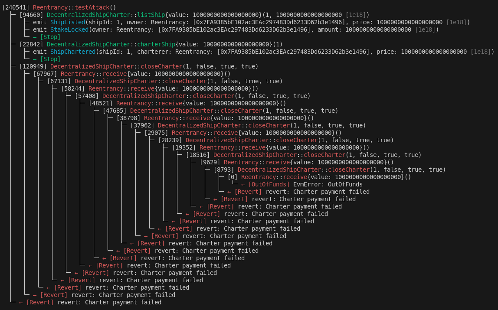

# DecentralizedShipCharter: Charter de Embarcaciones en Ethereum

El concepto de "charter de embarcaciones" se refiere al contrato mediante el cual una persona o entidad (el arrendador o propietario) permite que otra persona (el arrendatario) utilice su embarcación por un período determinado a cambio de un pago. Tradicionalmente, estos contratos involucran acuerdos legales complejos para definir los términos de uso, la duración del alquiler, las responsabilidades financieras y las condiciones de navegación.

En el contexto de Ethereum y contratos inteligentes, el concepto de charter de embarcaciones puede ser automatizado y descentralizado. Un contrato inteligente de charter de embarcaciones en Ethereum podría permitir que los propietarios de embarcaciones listen sus embarcaciones para alquilar, mientras que los arrendatarios podrían buscar y alquilar embarcaciones utilizando criptomonedas u otros activos digitales. Esto simplificaría el proceso al eliminar intermediarios y reducir costos administrativos y legales.
DecentralizedShipCharter: Aplicación y Guía para el Usuario

DecentralizedShipCharter es un contrato inteligente simple de prueba que simula el proceso de charter de embarcaciones de manera descentralizada en Ethereum. El contrato contiene al menos una vulnerabilidad que el estudiante debe identificar. Más abajo se muestra cual es la vulnerabilidad.

DecentralizedShipCharter contiene tres funciones:

- Listar una Embarcación para Charter:
    - Para listar una embarcación, el propietario debe utilizar la función listShip.
    - Parámetros: itemId (identificador único de la embarcación), price (precio de alquiler en Ether).

- Charter de una embarcación:
    - Los potenciales arrendatarios pueden alquilar una embarcación utilizando la función charterShip.
    - Parámetro: itemId (identificador de la embarcación que se quiere alquilar).

- Cerrar un charter:
    - Después de finalizar el período de alquiler, el propietario puede cerrar el charter y recibir el pago utilizando la función closeCharter.
    - Parámetros: itemId (identificador de la embarcación), reimburseBuyer (booleano para reembolsar al arrendatario), paySeller (booleano para pagar al propietario), releaseSellerStake (booleano para liberar la garantía del propietario).

El contrato de test DecentralizedShipCharterTest contiene algunos tests básicos del contrato.

- Variables:
    - charter: variable de instancia del contrato DecentralizedShipCharter que estamos probando.
    - OWNER: dirección del propietario de la embarcación que estamos listando para charter.
    - PRICE: Precio en Ether para alquilar la embarcación.
    - itemId: identificador único de la embarcación que se está listando.

- Funciones:
    - setUp(): esta función se ejecuta automáticamente antes de cada prueba (test) para inicializar el entorno de prueba.
    - testCloseCharter_ReimburseCharterer_PayOwner_ReleaseStake(): caso típico de éxito de charter.
    - testCloseCharter_ReimburseChartererOnly(): caso reembolso solo al arrendador.
    - testCloseCharter_PayOwnerOnly(): caso paga solo al propietario.
    - testCloseCharter_ReleaseStakeOnly(): caso libera stake.

# Exploit

## Reentrancy

La reentrada (reentrancy) se da cuando ocurre un bucle entre dos contratos
porque dos funciones se llaman mutuamente sin comprobar adecuadamente
las variables de estado. Si en este bucle, además, se modifican variables
críticas (como el balance del contrato) entonces se trata de una
vulnerabilidad crítica.

En el caso más típico el atacante explota un contrato con una función
vulnerable que no realiza las comprobaciones y que llama a la función
receive del atacante. En la función receive del atacante se produce
de nuevo una llamada a la función de la víctima, iniciando el bucle.

## Test reentrada

En el caso de DecentralizedChipCharter existe una reentrada en la función closeSale, que
además es pública y utiliza fondos del contrato para pagar a los usuarios.
Se trata por tanto de una vulnerabilidad crítica.

Foundry es un entorno de pruebas que permite simular una blockchain y testar
los contratos. Por ejemplo, se pueden simular diferentes usuarios, diferentes
condiciones iniciales, despliegue de los contratos, etc.
Los contratos de testeo heredan de Test.

Se proporciona un contrato Reentrancy.sol que explota la vulnerabilidad.
El código del ataque es el siguiente:
```
function testAttack() external payable createLegitSales() {
    charter.charterShip{value: PRICE}(itemId);
    charter.closeCharter(itemId, false, true, true);
}

// Fallback function to continue the attack if funds are received
receive() external payable {
    if (address(tx.origin).balance >= PRICE) {
        charter.closeCharter(itemId, false, true, true);
    }
}
```

La traza de ejecución se muestra en la siguiente imagen.



Se pueden observar el bucle en las llamadas recursivas entre closeSale
y receive, hasta que finalmente la tienda se queda sin fondos.

# Soluciones

## ReentrancyGuard de openzeppelin

Una posible solución es utilizar el contrato ReentrancyGuard.sol de openzeppelin.

El contrato víctima pasa a heredar de ReentrancyGuard y en la función vulnerable
se añade el modificador nonReentrant(). Se proporciona el contrato
Faillapop_shop_sec.sol con las modificaciones realizadas.

Después de añadir estas modificaciones podemos comprobar con Foundry como
la reentrada ya no ocurre.


## Patrón CEI

No obstante, el ReentrancyGuard solo soluciona algunos tipos de reentrada.
Sería recomendable además comprobar que la implementación se ajusta al
patrón CEI (Checks - Effects - Interactions).

