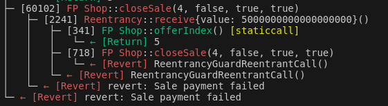

## The Faillapop protocol

The Faillapop protocol is a vulnerable-by-design protocol to help Web3 security students practice their skills in a fun environment. The protocol is composed of multiple contracts that interact with each other to create a decentralized buying and selling platform. Disputes are resolved through a DAO and malicious sellers are checked by forcing a deposit before selling anything... but there have been a lot of bad decisions during this process :mag:. 

You will find common solidity security issues, dubious centralization and logical loopholes. Do not forget to think about others such as flash loans and Out-Of-Gas exceptions! 

Try to perform a full mock audit! Create your own professional report mimicking those of well-known companies such as Oak Security, Trail of Bits, Hacken, or Halborn. Imagine that you are getting paid for this and trying to do the best job possible! not just finding bugs but also crafting proper paragraphs for your report. 

Solutions are not provided along this repo but the documentation has been created following the NatSpec format and the following diagram will help you get a grasp of the whole architecture.


## Reentrancy

La reentrada (reentrancy) se da cuando ocurre un bucle entre dos contratos
porque dos funciones se llaman mutuamente sin comprobar adecuadamente
las variables de estado. Si en este bucle, además, se modifican variables
críticas (como el balance del contrato) entonces se trata de una
vulnerabilidad crítica.

En el caso más típico el atacante explota un contrato con una función
vulnerable que no realiza las comprobaciones y que llama a la función
receive del atacante. En la función receive del atacante se produce
de nuevo una llamada a la función de la víctima, iniciando el bucle.

## Test reentrada

En el caso de Faillapop existe una reentrada en la función closeSale, que
además es pública y utiliza fondos del contrato para pagar a los usuarios.
Se trata por tanto de una vulnerabilidad crítica.

Foundry es un entorno de pruebas que permite simular una blockchain y testar
los contratos. Por ejemplo, se pueden simular diferentes usuarios, diferentes
condiciones iniciales, despliegue de los contratos, etc.
Los contratos de testeo heredan de Test.

Se proporciona un contrato Reentrancy.t.sol que explota la vulnerabilidad.
El código del ataque es el siguiente:
```
function test_attack() external payable createLegitSales() {
    shop.doBuy{value: 5 ether}(shop.offerIndex()-1);
    shop.closeSale(shop.offerIndex()-1, false, true, true);
}
receive() external payable {
    if(address(tx.origin).balance >= 1 ether) {
        shop.closeSale(shop.offerIndex()-1, false, true, true);
    }
}
```

La traza de ejecución se muestra en la siguiente imagen.


Se pueden observar el bucle en las llamadas recursivas entre closeSale
y receive, hasta que finalmente la tienda se queda sin fondos.

## Análisis estático

Una forma de comprobar las vulnerabilidades, y de descubrir más, es recurrir
a la herramienta slither (análisis estático).


## Posible solución, ReentrancyGuard de openzeppelin

Una posible solución es utilizar el contrato ReentrancyGuard.sol de openzeppelin.

El contrato víctima pasa a heredar de ReentrancyGuard y en la función vulnerable
se añade el modificador nonReentrant().

Despúes de añadir estas modificaciones podemos comprobar con Foundry como
la reentrada ya no ocurre.



